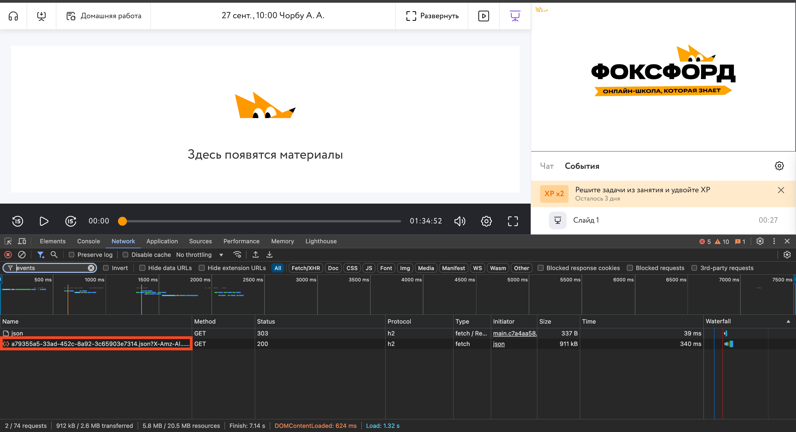

# Foxford Events Viewer

Простое веб-приложение, предназначенное для отображения эвентов с вебинаров Фоксфорда в читаемом виде

## Как получить JSON с эвентами?

Его можно увидеть при заходе на вебинар во вкладке "Network" в девтулзах, введя в поиск "events"

## Список доступных функций

- Просмотр сообщений из чата, в том числе удаленных модератором или отправителем
